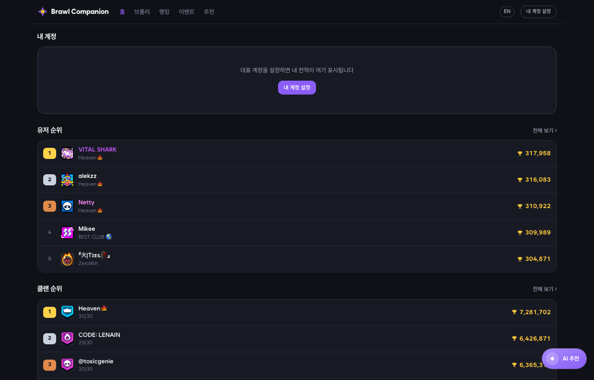
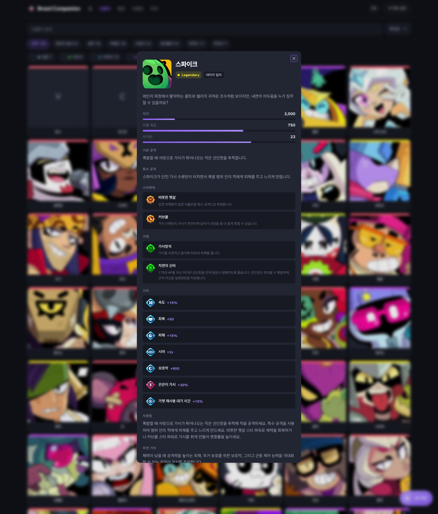
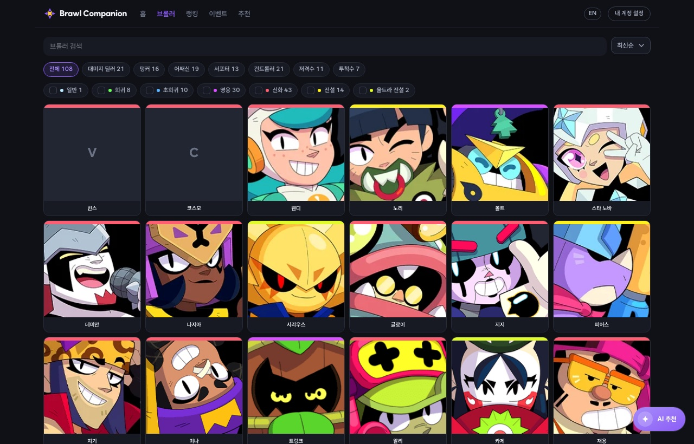
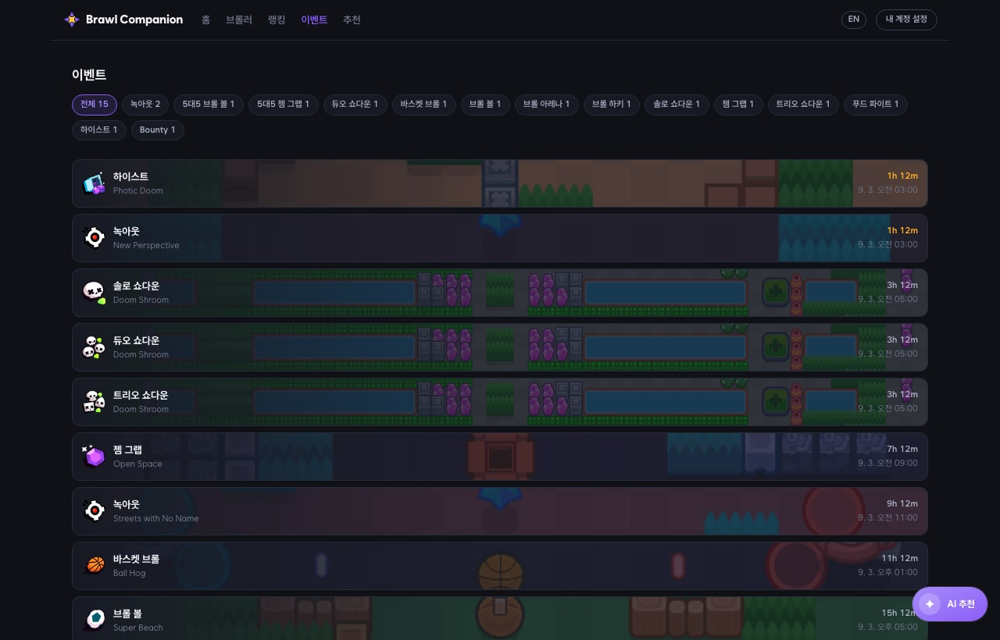

<div align="center">

# ✦ Brawl Companion

**브롤스타즈 전적 · 브롤러 도감 · 이벤트를 한 화면에서**

[](https://brawl-side.vercel.app)
[](https://nextjs.org)
[](https://www.typescriptlang.org)
[](#검증)

한국어 · English · 비공식 팬 프로젝트



</div>

---

## 무엇을 하나

| | |
|---|---|
| 🏠 **홈** | 유저·클랜 순위와 진행 중인 이벤트, 내 계정 요약 |
| 🎯 **브롤러** | 108종 도감. 영문·한글 동시 검색, 역할·희귀도 필터 |
| 🏆 **랭킹** | 국가 10종 × 플레이어/클럽. 무한 스크롤, 내 계정 하이라이트 |
| 🗺️ **이벤트** | 현재 로테이션을 종료 임박순으로. 맵 이미지와 카운트다운 |
| 💡 **추천** | 설문 4문항 + 내 계정 성향을 섞어 맞는 브롤러를 고름 |
| 👤 **프로필** | 태그 조회, 대표 계정 지정, 즐겨찾기, 최근 전투 25전 |
| ✦ **AI 도우미** | 본인 API 키로 쓰는 채팅 (BYOK) |

---

## 화면

### 브롤러 상세

게임이 쓴 **기본 공격·특수 공격 설명**, 능력과 기어의 실제 수치, 그리고 미리 생성해 둔 **사용법·추천 기어**가 한 장에 들어갑니다. AI 키가 없어도 보입니다.



### 브롤러 도감 · 이벤트

<table>
<tr>
<td width="50%"></td>
<td width="50%"></td>
</tr>
<tr>
<td align="center"><sub>대표 계정이 있으면 카드에 내 트로피가 얹힙니다</sub></td>
<td align="center"><sub>맵 이미지 배경과 실시간 카운트다운</sub></td>
</tr>
</table>

---

## 설계에서 신경 쓴 것

> **개인 데이터와 공유 데이터의 캐시를 나눴습니다.**
> 랭킹·이벤트처럼 모두에게 같은 응답은 서버에서 받아 캐시하고, 계정 정보만 클라이언트가 가져옵니다. 한 응답에 섞으면 개인 데이터 때문에 전체가 캐시 불가능해집니다. 공식 API 가 프록시를 거쳐 왕복 500ms 라 캐시가 선택이 아니었습니다.

> **AI 키는 브라우저 밖으로 나가지 않습니다.**
> 채팅은 브라우저가 제공자(Gemini · OpenAI · Anthropic)를 직접 호출합니다. 우리 서버는 키를 보지도, 저장하지도 않습니다.

> **AI 설명은 미리 만들어 파일로 커밋합니다.**
> 실시간 호출이 아니라 정적 파일이라 응답이 즉시 나오고, 무엇보다 **사람이 읽고 고칠 수 있습니다.** 생성 스크립트는 손으로 고친 파일을 덮지 않습니다.

> **추천은 AI 가 하지 않습니다.**
> 규칙 기반 벡터 스코어링이 브롤러를 고르고 AI 는 설명만 씁니다. 그래야 없는 브롤러를 지어내지 않고 같은 입력에 같은 답이 나옵니다.

---

## 기술 스택

```
Next.js 16 (App Router) · React 19 · TypeScript
Tailwind v4 · shadcn/ui · Radix · vaul
next-intl (en/ko) · TanStack Query
Vitest + Testing Library
Vercel
```

---

## 시작하기

```bash
npm install
cp .env.example .env.local   # 아래 참고
npm run dev
```

### 환경변수

| 변수 | 필수 | 용도 |
|---|:---:|---|
| `BRAWL_STARS_TOKEN` | ✅ | 공식 API 키 |
| `GEMINI_API_KEY` | — | AI 설명을 직접 생성할 때만. 앱 실행엔 불필요 |

공식 API 키는 **IP 화이트리스트**가 걸려 있어 서버리스에서 직접 부르면 403 이 납니다. 이 프로젝트는 [RoyaleAPI 프록시](https://docs.royaleapi.com/proxy.html)를 경유하므로, [개발자 포털](https://developer.brawlstars.com)에서 키를 만들 때 화이트리스트에 `45.79.218.79` 를 넣으면 됩니다.

### 데이터 생성

브롤러 스탯·능력·이미지 URL 은 빌드 산출물이라 앱은 런타임에 게임 데이터를 받지 않습니다. **게임 업데이트로 브롤러가 추가됐을 때만** 다시 만듭니다.

```bash
npm run build:data                  # 브롤러 · 모드 · 능력 설명
npm run build:ai                    # AI 설명 (없는 종만 생성)
npm run build:ai -- --id 16000000   # 한 종만 다시
```

### 검증

```bash
npx tsc --noEmit && npx eslint . && npm test
```

---

## 구조

```
src/
  app/[locale]/       페이지 — 홈 · 브롤러 · 랭킹 · 이벤트 · 추천 · 프로필
  app/api/            라우트 핸들러 5개. 캐시 정책이 여기 있다
  components/
    display/          순수 표시. props 만 받는다
    state/            빈 상태 · 에러 · 스켈레톤
    {page}/           페이지 전용
    ui/               shadcn 생성물
  lib/                순수 함수와 도메인 로직. 테스트가 여기 붙는다
  data/               빌드 산출물 — 게임 데이터 · AI 성향 색인
scripts/              생성 스크립트
public/data/ai/       AI 설명 (브롤러별 · 로케일별)
```

설계 근거와 API 실측 결과는 [`.claude/`](.claude/) 아래에 있습니다 — 설계서, 코딩 컨벤션, [API 레퍼런스](.claude/docs/brawl-stars-api-reference.md), 기능별 구현 플랜.

---

## 한계

- **랭킹은 200위까지** — 공식 API 제약입니다
- **전적은 최근 25전** — 배틀로그가 그만큼만 줍니다. 추이를 쌓으려면 DB 가 필요해 다음 버전으로 미뤘습니다
- **신규 브롤러는 데이터가 늦습니다** — 한글명·이미지가 순차적으로 채워집니다. 빌드를 실패시키지 않고 폴백으로 처리합니다
- **기본·특수 공격 설명은 한국어만** — 게임 로케일 파일에만 있고 영문 소스가 없습니다

---

<div align="center">
<sub>

This material is unofficial and is not endorsed by Supercell.
For more information see Supercell's [Fan Content Policy](https://www.supercell.com/fan-content-policy).

이미지는 [Brawlify CDN](https://github.com/Brawlify/CDN) 을 사용합니다.

</sub>
</div>
